# PSim-RCAM
Welcome to PSim-RCAM - short for Python Simulation - Research Civil Aircraft Model!
Partial Python implementation of the non-linear flight dynamics model proposed by:
Group for Aeronautical Research and Technology Europe (GARTEUR) - Research Civil Aircraft Model (RCAM)
http://garteur.org/wp-content/reports/FM/FM_AG-08_TP-088-3.pdf
HOWEVER!!!
    # many equations and values are only available in the newer RCAM document (rev Feb 1997)
    # which is not availble to the public
    # the values from this reference were obtained from the youtube videos below

The excellent tutorials by Christopher Lum (for Matlab/Simulink) were used as a guide:
1 - Equations/Modeling
https://www.youtube.com/watch?v=bFFAL9lI2IQ
2 - Matlab implementation
https://www.youtube.com/watch?v=m5sEln5bWuM

The program runs the integration loop at a target pf 400Hz, adjusting the integration steps to the available computing cycles
It uses Numba to speed up the main functions involved in the integration loop

Output is sent to FlightGear (FG), over UDP, at a reduced frame rate (60)
The FG interface uses the class implemented by Andrew Tridgel (fgFDM):
https://github.com/ArduPilot/pymavlink/blob/master/fgFDM.py

currently, the UDP address is set to the local machine.
A second UDP address is available for an extra screen/instance of FG

Run this Python program and from a separate terminal, start FG with one of the following commands (depending on the aircraft addons installed):
fgfs --airport=KSFO --runway=28R --aircraft=ufo --native-fdm=socket,in,60,,5500,udp --fdm=null
fgfs --airport=KSFO --runway=28R --aircraft=Embraer170 --aircraft-dir=./FlightGear/Aircraft/E-jet-family/ --native-fdm=socket,in,60,,5500,udp --fdm=null
fgfs --airport=KSFO --runway=28R --aircraft=757-200-RB211 --aircraft-dir=~/.fgfs/Aircraft/org.flightgear.fgaddon.stable_2020/Aircraft/757-200 --native-fdm=socket,in,60,,5500,udp --fdm=null
fgfs --airport=KSFO --runway=28R --aircraft=757-200-RB211 --aircraft-dir=~/.fgfs/Aircraft/org.flightgear.fgaddon.stable_2020/Aircraft/757-200 --native-fdm=socket,in,60,,5500,udp --fdm=null --enable-hud --turbulence=0.5 --in-air  --enable-rembrandt
DRI_PRIME=1 fgfs --airport=LOWI  --aircraft=Embraer170 --aircraft-dir=./FlightGear/Aircraft/E-jet-family/ --native-fdm=socket,in,60,,5500,udp --fdm=null --enable-hud --in-air --fog-disable --shading-smooth --texture-filtering=4 --timeofday=morning --altitude=2500 --prop:/sim/hud/path[1]=Huds/fte.xml 2>/dev/null

If a joystick is detected, then inputs come from it
Otherwise, offline simulation is run.

Here is the simulation flowchart:

```mermaid
graph TD
    %% Global Styles
    %% Main Loop (Blue): Shows the sequential execution of every frame (Sensors -> Inputs -> Logic -> Actuators -> Physics -> Output).
    classDef process fill:#9B4501,stroke:#01579b,stroke-width:2px;
    classDef decision fill:#2D68FB,stroke:#fbc02d,stroke-width:2px;
    %% input/output stuff (magenta)
    classDef io fill:#7D2E79,stroke:#2e7d32,stroke-width:2px;
    %% Parallel Workers (Purple/Dotted): Shows that Networking and Engine calculations happen asynchronously to the main loop.
    classDef thread fill:#46A21F,stroke:#7b1fa2,stroke-width:2px,stroke-dasharray: 5 5;
    %% Physics Core (Red): This highlights the mathematically heavy parts (Trimming, RCAM Model, Ground Forces).
    classDef physics fill:#1d9191,stroke:#c62828,stroke-width:2px;

    Start([Start PSim.py]) --> LoadParams[Load rcam_parameters.json]
    LoadParams --> InitJoy[Init Pygame & Joystick]
    InitJoy --> CheckMode{Joystick Present?}
    
    %% Initialization Phase
    subgraph Init [Initialization Phase]
        CheckMode -- Yes --> OnlineMode[OFFLINE False]
        CheckMode -- No --> OfflineMode[OFFLINE True]
        OnlineMode --> StartThreads[Start Network & Engine Threads]
        
        subgraph Workers [Background Workers]
            direction TB
            NetTX(Network TX Thread<br/>Python UDP -> FG FDM)
            NetRX(Terrain RX Thread<br/>FG Terrain -> Python UDP)
            EngProc(Engine Process<br/>Multiprocessing)
        end
        
        StartThreads -.- NetTX
        StartThreads -.- NetRX
        StartThreads -.- EngProc
        
        OnlineMode --> TrimCalc
        OfflineMode --> TrimCalc
        
        TrimCalc[Trim Aircraft<br/>Minimize Cost Function]:::physics
        TrimCalc --> SetIC[Set Initial Conditions & Integrators]
    end

    SetIC --> SimLoop{Time < Max?}

    %% Main Simulation Loop
    subgraph MainLoop [400Hz Simulation Loop]
        SimLoop -- Yes --> DesatThrottle[1. De-saturate Throttles]
        
        DesatThrottle --> ReadInputs[2. Read Inputs]
        
        ReadInputs --> GetJoy[* Get Joystick Axes/Buttons]:::io
        GetJoy --> Logic[3. Logic & Saturation]
        
        Logic --> AirGnd[* Check Air/Ground State]
        AirGnd --> Spoilers[* Spoilers & Auto-Brake]
        Spoilers --> Actuators[4. Actuator Dynamics]
        
        Actuators --> Lag[* Apply 1st Order Lag<br/>Surfaces & Brakes]
        
        %% GETTING THRUST (Reading from Queue)
        Lag --> EngRead[5. Get Async Engine Thrust]
        EngProc -.-> EngRead
        
        EngRead --> Physics[6. Physics Integration]
        
        subgraph PhysicsEngine [Physics Core]
            Physics --> SetParams[Set integrator params<br/>U, rho, h, gnd]
            SetParams --> IntegrateAC[Integrate Aircraft<br/>RK45 / dopri5]
            
            IntegrateAC --> CallModel[[RCAM_model]]:::physics
            CallModel --> GroundForce[Calc Ground Forces<br/>Spring/Damper/Friction]:::physics
            GroundForce --> Aero[Calc Aero Forces/Moments]:::physics
            Aero --> Equations[6-DOF Equations of Motion]:::physics
            
            Equations --> NewState[New State X]
        end
        

        NewState --> Nav[7. Integrate Navigation<br/>Lat/Lon/Alt]
        
        Nav --> GetTerrain[8. Get Ground Altitude]:::io
        NetRX -.-> GetTerrain
        GetTerrain --> CalcAGL[9. Calculate AGL & Density]
        CalcAGL --> Logging[10. Logging & Output]
        Logging --> Observe[[* RCAM_observe]]:::physics
        Observe --> DataCol[* Append to Data Collector]
        
        %% TRIGGERS
        DataCol --> CheckFrame{60Hz FG Trigger?}
        
        CheckFrame -- Yes --> SendFG[Send UDP Packet to FlightGear]:::io
        SendFG -.-> NetTX
        CheckFrame -- No --> CheckEngTrigger
        
        %% NEW ENGINE TRIGGER LOGIC
        CheckEngTrigger{10Hz Engine Trigger?}
        SendFG --> CheckEngTrigger
        
        CheckEngTrigger -- Yes --> DispatchEng["Dispatch New Job<br/>(Alt, Mach, TLA)"]:::io
        DispatchEng -.-> EngProc
        CheckEngTrigger -- No --> RateLimit
        DispatchEng --> RateLimit
        
        RateLimit[Wait/Rate Limiter] --> SimLoop
    end

    %% Termination
    SimLoop -- No --> Cleanup[Stop Threads & Processes]
    Cleanup --> SaveCSV[Save test_data.csv]:::io
    SaveCSV --> Plot[Generate & Show Plots]:::process
    Plot --> End([End])

    %% Styling mappings
    class DesatThrottle,LoadParams,InitJoy,SetIC,ReadSensors,CalcAGL,ReadInputs,Logic,AirGnd,Spoilers,Actuators,Lag,EngRead,Physics,SetParams,IntegrateAC,NewState,Nav,Logging,DataCol,RateLimit,Cleanup process;
    class CheckMode,SimLoop,CheckFrame,CheckEngTrigger decision;
    class GetTerrain,GetJoy,SendFG,DispatchEng,SaveCSV io;
    class NetTX,NetRX,EngProc thread;
    class TrimCalc,CallModel,GroundForce,Aero,Equations,Observe physics;
```

